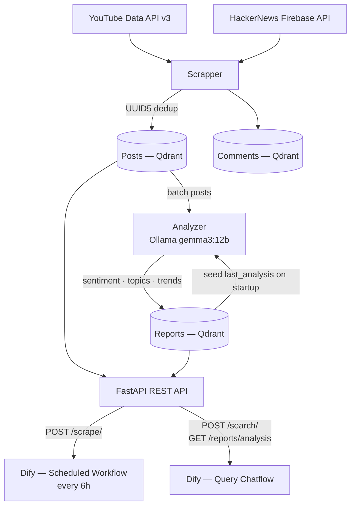
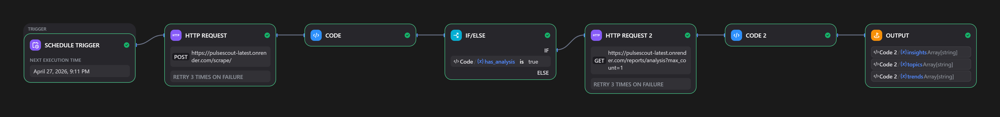
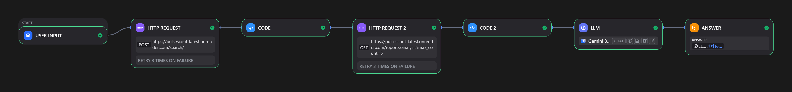

# PulseScout

Social Knowledge Doomscroll Agent that continuously monitors YouTube and HackerNews to extract market insights, trends, and sentiment.

## Architecture



### Project Structure

```
src/
  main.py                  # FastAPI entry point
  config/
    scraper_config.py      # Scraper decorator configs
    analyzer_config.py     # Analyzer decorator configs
  utils/
    scrap_util.py          # YouTube + HackerNews scrapers
    analyzer_util.py       # Ollama-based analysis (sentiment, topics, trends)
  models/
    base_model.py          # Qdrant ORM base class
    post_model.py          # Posts collection
    comment_model.py       # Comments collection
    report_model.py        # Reports collection
  controllers/
    scrape_controller.py   # Orchestrates scrape + analyze cycle
    reports_controller.py  # Analysis reports retrieval
    search_controller.py   # Vector search
  dtos/
    scrape_dto.py          # Response for /scrape
    search_dto.py          # Request/response for /search
    reports_dto.py         # Response for /reports/analysis
    common_dto.py          # Shared DTOs (TopicDto, TrendDto)
  routes/
    scrape_routes.py       # POST /scrape/
    search_routes.py       # POST /search/
    reports_routes.py      # GET /reports/analysis
    health_routes.py       # GET /health
tests/
  test_analyzer.py         # JSON parsing + prompt template tests
  test_scrapper.py         # Mocked YouTube + HN scraper tests
  test_config.py           # Decorator injection tests
  test_dtos.py             # Pydantic validation tests
  test_models.py           # ORM model serialization tests
  test_routes.py           # API endpoint tests
docs/
  scheduled_scrape.yml     # Dify scheduled workflow DSL
  query_chatflow.yml       # Dify query chatflow DSL
  screenshots/             # Workflow screenshots
```

## Setup

### Prerequisites

- Python 3.14+
- YouTube Data API v3 key ([console.cloud.google.com](https://console.cloud.google.com))
- Qdrant Cloud account ([cloud.qdrant.io](https://cloud.qdrant.io))
- Ollama Cloud API key ([ollama.com](https://ollama.com))

### Installation

```bash
git clone https://github.com/mohamedzait20003/PulseScout.git
cd PulseScout
pip install -r requirements.txt
```

### Configuration

Create a `.env` file:

```env
YOUTUBE_URI=https://www.googleapis.com/youtube/v3
YOUTUBE_KEY=your_youtube_api_key

HN_API_URI=https://hacker-news.firebaseio.com/v0

QDRANT_URI=https://your-cluster.cloud.qdrant.io
QDRANT_KEY=your_qdrant_api_key

OLLAMA_MODEL=gemma3:12b
OLLAMA_URI=https://ollama.com
OLLAMA_KEY=your_ollama_api_key
```

### Run

```bash
uvicorn src.main:app --host 0.0.0.0 --port 8000
```

API docs available at `http://localhost:8000/docs`

### Tests

```bash
pytest -v
```

All tests run with mocked external services. No API keys required for testing.

## API Endpoints

### POST /scrape/

Triggers a full scrape + analyze cycle across 5 monitored topics:
`AI market trends` · `tech startup funding` · `venture capital` · `emerging technology` · `consumer sentiment`

Returns sentiment breakdown, top topics, actionable insight, and trend comparison against the previous batch.

### GET /reports/analysis

Returns stored analysis reports sorted by most recent, each containing sentiment breakdown, top topics, actionable insight, and trend comparison.

```
GET /reports/analysis?max_count=5
```

### POST /search/

Vector search across stored posts.

```json
{
  "query": "machine learning",
  "n": 10
}
```

### GET /health

Health check. Returns `{"status": "ok", "service": "PulseScout"}`.

## Orchestration

PulseScout exposes a REST API that Dify orchestrates via two workflows.

### Workflow 1 — Scheduled Scrape

Runs every 6 hours automatically. Calls `POST /scrape/`, parses the response, and fetches the latest analysis report only if new posts were stored and LLM analysis succeeded.

```
[Schedule Trigger: every 6h]
        ↓
[HTTP: POST /scrape/]
        ↓
[Code: parse_scrape]
        ↓
[IF: has_analysis = "true"]
        ↓ yes                    ↓ else
[HTTP: GET /reports/analysis]  [End]
        ↓
[Code: parse_analysis]
        ↓
[End: insights, topics, trends]
```



### Workflow 2 — Query Chatflow

Natural language interface over stored insights. Takes a user question, searches for relevant posts, fetches recent analysis, then synthesizes a market intelligence answer via LLM (Gemini Flash).

```
[Start: user_query]
        ↓
[HTTP: POST /search/]
        ↓
[Code: parse_search]
        ↓
[HTTP: GET /reports/analysis]
        ↓
[Code: parse_analysis]
        ↓
[LLM: Gemini Flash — market analyst prompt]
        ↓
[Answer]
```



DSL exports: [`docs/scheduled_scrape.yml`](docs/scheduled_scrape.yml) · [`docs/query_chatflow.yml`](docs/query_chatflow.yml)

## Deployment

### Docker

```bash
docker build -t pulsescout .
docker run -p 8000:8000 --env-file .env pulsescout
```

### CI/CD

GitHub Actions pipeline: test → build Docker image → push to GHCR → deploy to Render.

## Tech Stack

| Component | Technology |
|---|---|
| API | FastAPI |
| Scraping | YouTube Data API v3, HackerNews Firebase API |
| Vector Store | Qdrant Cloud (Posts · Comments · Reports) |
| LLM Analysis | Ollama Cloud (gemma3:12b) |
| Embeddings | Hash-based (SHA256 → 384-dim vectors) |
| CI/CD | GitHub Actions → GHCR → Render |
| Testing | pytest (fully mocked) |
| Orchestration | Dify (scheduled workflow + query chatflow) |
